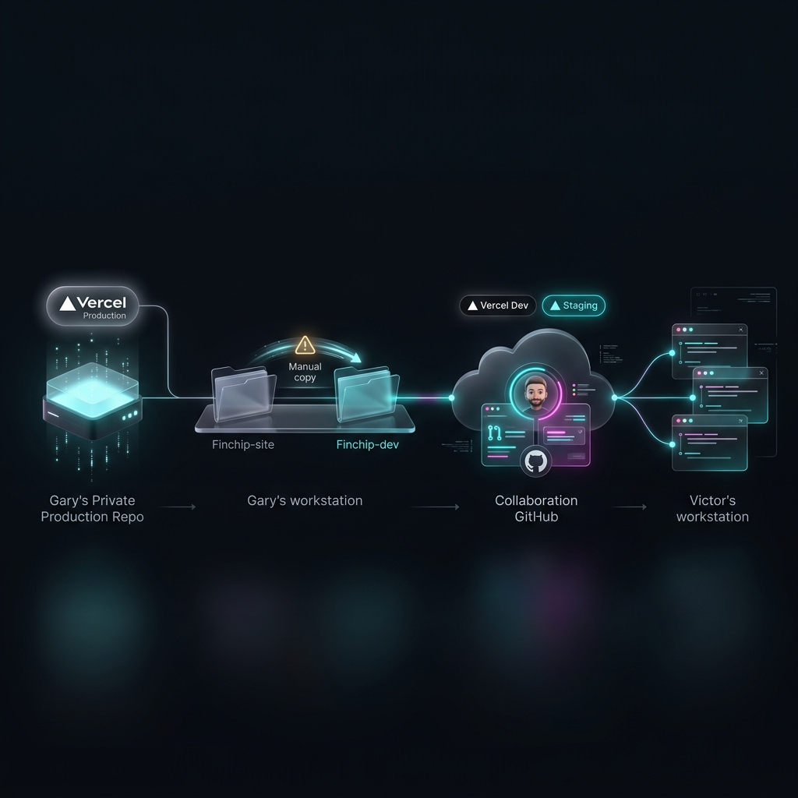
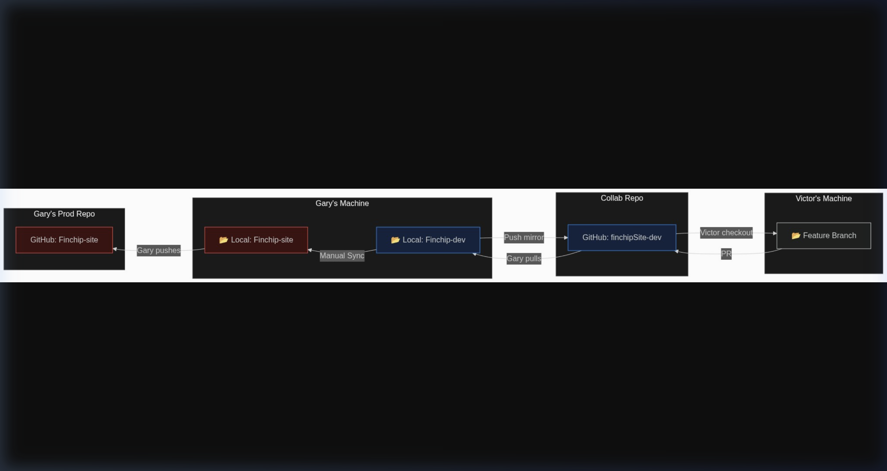

# Finchip Development Handoff Workflow

This document illustrates the handoff process between Gary and Victor, emphasizing the physical isolation of the Production environment and the manual synchronization process.

## Process Overview (UI Mockup)

## Technical Flowchart

## Mermaid Source Code

```mermaid
graph LR
    %% 1. Gary's Private Realm (Far Left)
    subgraph Private_Hub ["Gary's Private GitHub"]
        ProdRepo["Production Repo<br/>(Private)"]
    end

    %% 2. Gary's Local Machine (Middle Left)
    subgraph Gary_PC ["Gary's Computer (The Bridge)"]
        direction TB
        G_SITE["📂 Finchip-site<br/>(Local Prod)"]
        G_DEV["📂 Finchip-dev<br/>(Local Mirror)"]
        ManualSync{{"Manual Sync<br/>(Copy/Paste - Exclude .git)"}}
        
        G_SITE <==> ManualSync <==> G_DEV
    end

    %% 3. Collaboration Hub (Middle Right)
    subgraph Collab_Hub ["GitHub: finchipSite-dev"]
        direction TB
        DevRepo["Main / prod-mirror"]
        PR_Action["Gary Reviews & Merges PRs"]
        DevRepo --- PR_Action
    end

    %% 4. Victor's Machine (Far Right)
    subgraph Victor_PC ["Victor's Computer"]
        V_FEAT["📂 Feature Branches"]
    end

    %% 5. Vercel Deployments (Top/Bottom Overlay)
    subgraph Vercel ["Vercel Deployment"]
        V_Prod["finchip.ai<br/>(Production)"]
        V_Staging["finchip-staging.vercel.app"]
        V_Dev["finchip-dev.vercel.app"]
    end

    %% --- Connections (Left to Right) ---
    
    %% Left Link
    ProdRepo <== "Gary Pushes" ==> G_SITE
    ProdRepo -- "Auto-Deploy" --> V_Prod

    %% Right Link (Gary to Collab)
    G_DEV <== "Push prod-mirror" ==> DevRepo
    
    %% Victor Link
    DevRepo -- "New Branch" --> V_FEAT
    V_FEAT -- "Submit PR" --> DevRepo
    
    %% Deployments from Collab
    DevRepo -- "Staging Branch" --> V_Staging
    DevRepo -- "Dev Branch" --> V_Dev

    %% Styles
    style Gary_PC fill:#1a1a1a,stroke:#444,color:#fff
    style Victor_PC fill:#1a1a1a,stroke:#444,color:#fff
    style ManualSync fill:#333,stroke:#faad14,stroke-width:2px,color:#faad14
    style V_Prod fill:#3e1010,stroke:#ff4d4f
    style V_Staging fill:#10233e,stroke:#1890ff
    style V_Dev fill:#10233e,stroke:#1890ff
```

## Key Process Details

1. **Isolation**: Gary's local `Finchip-site` workspace is the only one connected to the Production GitHub Repo.
2. **The Mirror**: The `finchipSite-dev` repository serves as a synchronization point for collaboration. It triggers **Dev** and **Staging** builds on Vercel.
3. **Manual Sync**: When Gary wants to promote changes from the collaborative repo to production (or vice-versa), he performs a manual file copy between his two local folders, carefully avoiding overwriting the `.git` metadata to maintain repository integrity.
